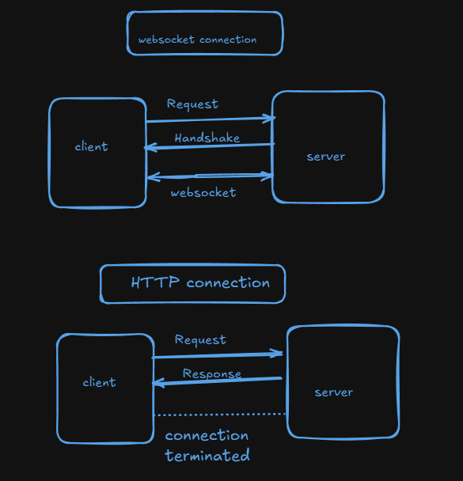

# Websockets

WebSocket is a computer communications protocol that allows for two-way communication between a client and server over a single connection.

# how it works

WebSockets create a persistent connection that can last indefinitely, allowing the client and server to send data at any time with minimal overhead.

# benefits

WebSockets address many limitations of the HTTP protocol, which requires multiple HTTP calls and TCP connections for bidirectional communication. WebSockets provide an alternative to the continuous polling that HTTP requires.

# typescript

what is ts-node packages---
this packages helps to transpile and execute the typescript code to javascript

# working

<h1>import {Server} from 'socket.io'</h1>

<p>socket.io is configured in both frontend and backend. socket from the frontend send the get request or for the connection of websocket. if the websocket accept the request or we can say send the handshake response then websocket connection is done. </p>



# methods in websocket

post --on
get -- emit

```javascript
io.on("connection", (socket) => {
  socket.on("data", (data) => {
    console.log(data);
    socket.emit("suniraxu", {
      message: "data received from frontend",
    });
  });
  console.log("someone connected (client)");
});
```
